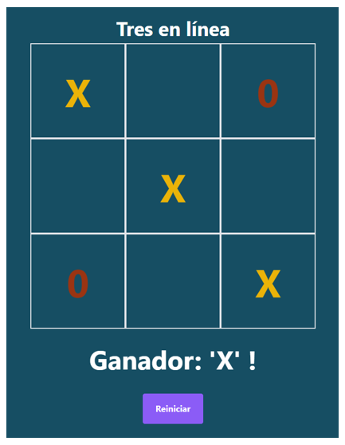

# Proyecto: ```Juego Three In Line```

El siguiente proyecto consistió en el diseño de un juego utilizando el framework Vue, con el fin de aplicar los conceptos y técnicas aprendidas en la asignatura ```Desarrollo de aplicaciones para internet```. El proyecto se destaca por la implementación de una lógica de juego compleja utilizando JavaScript, y por el uso de ciertas directivas de Vue para crear una experiencia de juego dinámica en una aplicación de página única (single page application).  
Debido a que se generaron los archivos estáticos del proyecto, es posible visualizar el sitio web en ejecución a través de la siguiente URL: https://justfym.github.io/Proyecto_JuegoThreeInLine_VueJS/

### Stack de tecnologías.
<p align="center">
  
</p>

## Vista gráfica del juego ```Juego Three In Line```

<p align="center">
  
</p>
